# Hangman Movie Game

Hangman- The Movie Edition is a Python terminal game which runs on the Code Institute mock terminal in Heroku.

Users can try to guess the hidden movie title by guessing letters within the word before their lives run out.

[Here is the live version of the game](https://hangman-game-trispatt-99066ec34865.herokuapp.com/)

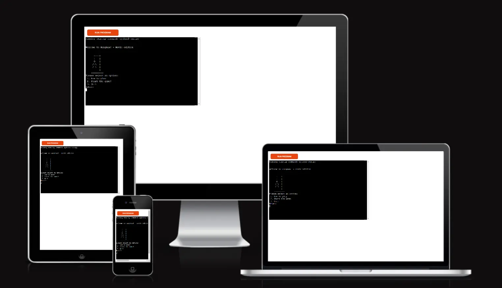

## How to play

Hangman is based on the clasic pen and paper game.

A word is generated at random by the computer from a list of words. In this edition, the word is the title
of a famous movie.

At the start, the word is hidden. Each letter of the word is displayed as an underscore. 

The user must guess a letter that they think is in that word. If correct, the underscore is replaced by the 
correctly guessed letter and the user guesses again.

If the guess is incorrect, then the user will lose a life. Also displayed on the screen is the gallows. For 
each incorrect answer, another body part of the hangman will be revealed as well as the previous incorrect
guesses. 

The aim is to guess the word before the whole of the hangman is hung, which is 6 lives.

## Features

### Exisiting Features

#### Start Menu

The start menu contains 3 possible options:
- How to play- the rules of the game
- Start the game- to start the game
- Quit- the option to exit out of the game

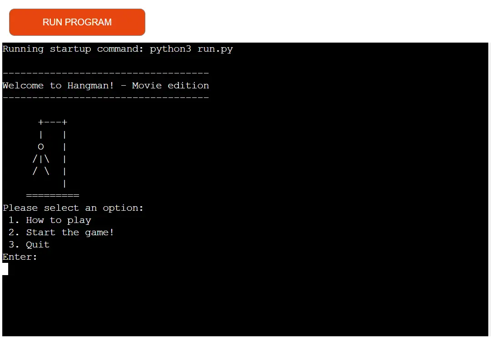

#### How to play

- This tells the user how to play the game and what the rules are.

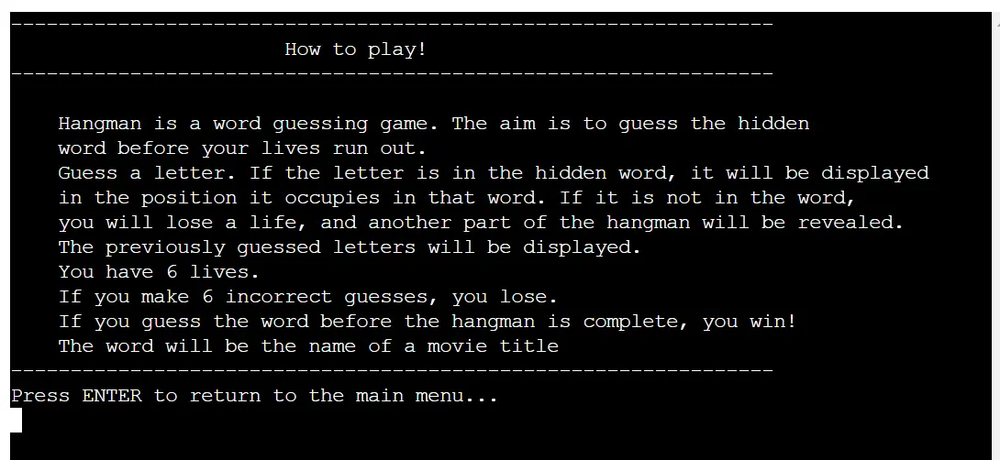

#### Start Game

- This starts the game. A random word is generated where the letters of the word are represented by
underscores. The gallows are shown, as well as a section for incorrect guesses. 

- The user is asked to enter their guess.

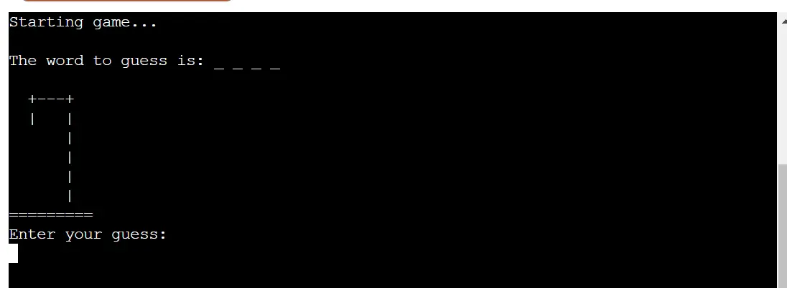

- Correct guess!

  - If correct, the user is informed and the letter is displayed where it is positioned in the word. 
  If there is more than one occurence of a letter, they are also displayed in their positions 
  within the word.

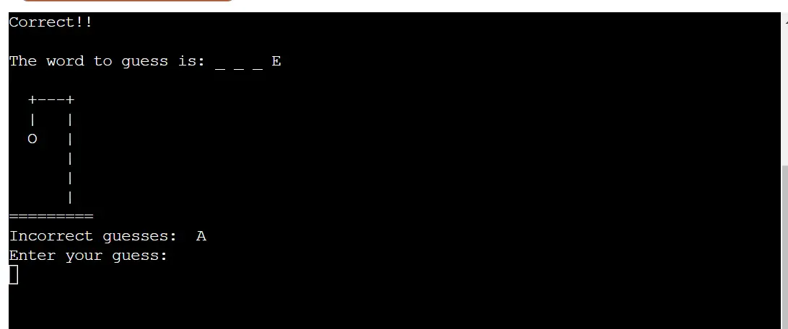

- Incorrect guess!

  - If the guess is incorrect, the user is informed, the previous guesses list is updated and the next
  body part of the hangman is revealed. 

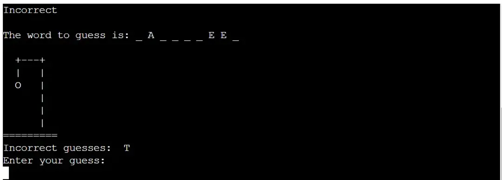

- Winning the game

  - The user wins when the word is correctly guessed before their lives run out.
  - The user is asked if they wish to return to the main menu.

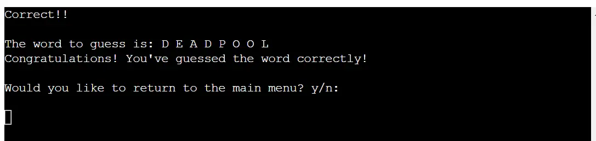

- Losing the game

  - The user loses when all the lives run out and all body parts of the hangman are displayed. 
  - The word to guess is displayed to the user.

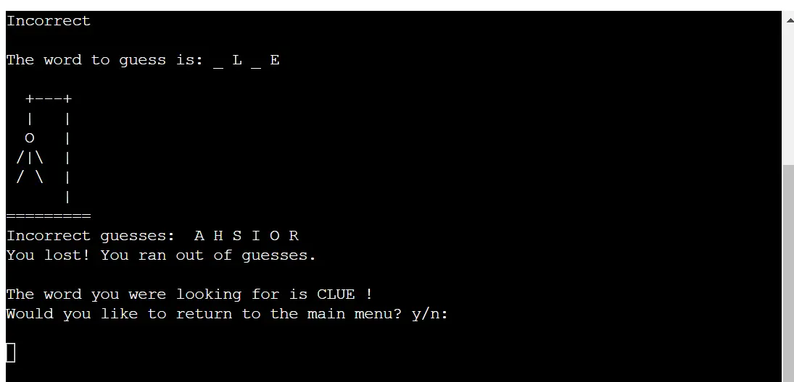

#### Input validation and Error checking

- Start menu
  - In the start menu, only the numbers 1,2 or 3 can be entered. If anything else is entered then the user
 is asked to input again; 1,2 or 3.

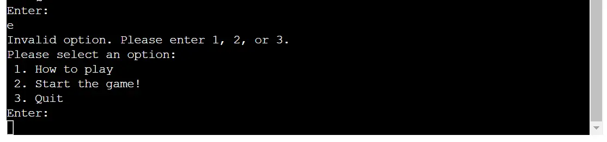

- The game
  - This only allows an input of a single letter. Numbers and special characters are invalid. If multiple
  letters are entered, this is also invalid. The error message is displayed and the user is asked to guess
  again. 
  - If the user has already guessed a letter, this is invalid and an error message is displayed.
  - The letters are all converted to uppercase and compared for validation.

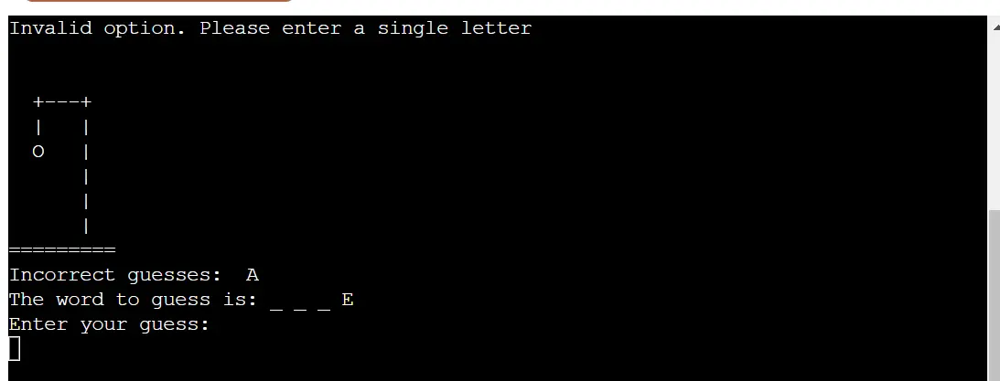

### Future Features

- Option of different themes
- The use of multiple words
- Option of difficulty level

## Design and logic

- Before I developed the game, I created a flow diagram in order to plan the logic and flow of the game at
various stages.

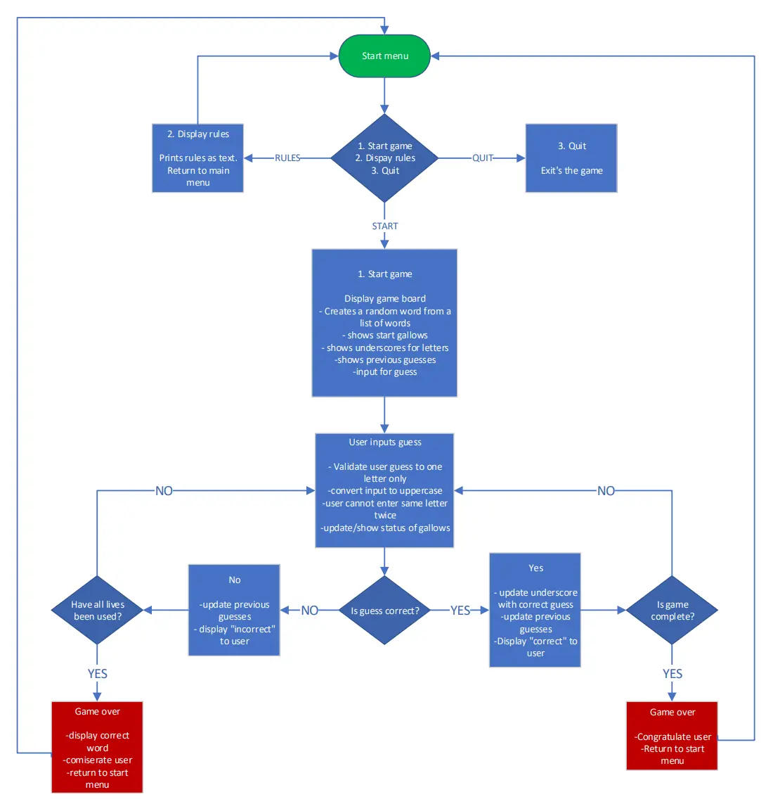

## Data Model

- The gallows images are ASCII art stored in a list in a seperate file; gallows.py. The words
used are also stored in a list in a seperate file; words.py. Both are imported at the top of the main
file; run.py. 
- Various variables are used to store game state and user input, such as `incorrect_guesses`, 
`max_incorrect_guesses`, `previous_guesses`, `hidden_word`, `hidden_letters`, and `guess`.
- The code defines several functions; `rules()`, `print_gallows()`, `clear_screen()`, `return_main_menu()`,
`multiple_letter()`, `start_game()`, and `start_menu()` to organize and encapsulate different aspects of 
the game's functionality.
- The game interacts with the user through input prompts and displays information using print()
statements.
- The `import random` and `import os` statements are used to import modules for generating random numbers
(for selecting a word from the words_list) and for clearing the terminal screen `clear_screen()`.

## Technologies used

- Python 3

## Frameworks, libraries and programs used

- Gitpod - To write the code
- Git - Version control
- Github - Storage of files online
- Am I responsive - To show a screenshot of the responsive design across multiple devices
- Heroku - For deploying the CLI project to a web browser interface

## Testing

I have manually tested the game as follows:

- Passed the code through a PEP8 linter. This did not return any errors.
- Manually tested on my terminal and in the CI Heroku terminal.
 - Entered letters and invalid numbers where only 1,2 and 3 should be inputted in menu screen.
 - Entered numbers, special characters, multiple letters, and previously guessed incorrect/ correct answers,
 where only a single letter should be inputted in the terminal.

### Bugs

| Test | Expected result | Actual Result | Fix | pass/ fail |
|------|-----------------|---------------|-----|------------|
|Guess the maximum number of guesses for the hangman to show (6)|After 6 guesses the game is over as the maximum number of lives is reached|The game gives the user an extra life(7)|Change the code to the length of the incorrect guesses -2| Pass |
|Exit from the game after playing. Question asked "would you like to return to main menu?"|If yes, the game is exited to the console|The loop continues and returns to the game. The code allowed for both statements to return a True value which continued the loop|Convert the answers y/n to "lower()", allowing for case-insensitive comparison|Pass|

### Unfixed bug

- No outstanding unfixed bugs

## Deployment

This project was deployed using the Code Institutes mock terminal for Heroku.

Steps for deployment:

  - Folk or clone this repository
  - Create a new Heroku app
  - Set the buildbacks to "python" and "NodeJS", in that order
  - Link the Heroku app to the resporitory
  - Click on deploy

### Forking the GitHub Repository

By forking the repository, we make a copy of the original repository on our GitHub account to view and change without affecting the original repository by using these steps:

1. Log in to GitHub and locate [GitHub Repository Hangman game](https://github.com/TrisPatt/hangman)
2. At the top of the Repository(under the main navigation) locate "Fork" button.
3. Now you should have a copy of the original repository in your GitHub account.

### Local Clone

1. Log in to GitHub and locate [GitHub Repository Hangman game](https://github.com/TrisPatt/hangman)
2. Under the repository name click "Clone or download"
3. Click on the code button, select clone with HTTPS, SSH or GitHub CLI and copy the link shown.
4. Open Git Bash
5. Change the current working directory to the location where you want the cloned directory to be made.
6. Type `git clone` and then paste The URL copied in the step 3.
7. Press Enter and your local clone will be created.
 
### Credits

- Code for the "clear_screen()" function researched on stack overflow
- Heroku template supplied by Code Institute
- Readme template supplied by Code Institute
- Link to ASCII art for gallows provided by my mentor Mitko Bachvarov
